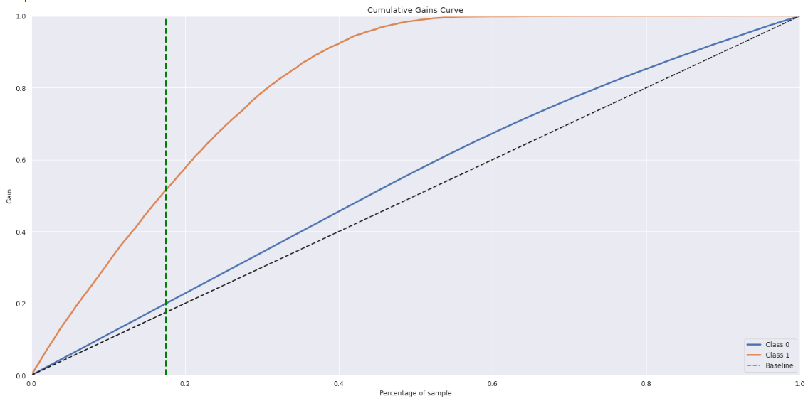

# Health Insurance Cross Sell

## Problema de negócio

A Insurance all é uma empresa fictícia de seguros de saúde cujo time de produtos está analisando o aumento do portfólio de serviços da empresa com a criação de um seguro automotivo. A partir disso, realizou uma pesquisa com cerca de 380 mil clientes que já possuem seguro de saúde sobre o interesse em contratar esse novo produto.

Para iniciar a oferta do novo seguro, a equipe de produtos selecionou 114090 mil novos clientes para receber a oferta pelo time de vendas através de ligações telefônicas. Entretanto, a equipe de vendas só tem capacidade para efetuar 20 mil ligações no período da campanha.

Assim foi solicitado à equipe de dados para construir um modelo que priorizasse os clientes que estariam mais interessados em contratar o seguro. Assim, ordenando essa lista de 114090 mil clientes de forma que aqueles com maior chance de contratar o seguro estejam no início dela.

**Dataset overview**

| **Variable** | **Meaning** |
|:------------:|-------------|
| Id  |  Unique ID for the customer |
| Gender  | Gender of the customer |
| Age | Age of the custome |
| Driving_License | 1: Customer does not have DL, 1 : Customer already has DL |
| Region_Code | Unique code for the region of the customer |
| Previously_Insured | 1: Customer already has Vehicle Insurance, 0 : Customer doesn't have Vehicle Insurance |
| Vehicle_Age | Age of the Vehicle |
| Vehicle_Damage | 1: Customer got his/her vehicle damaged in the past. 0 : Customer didn't get his/her vehicle damaged in the past. |
| Annual_Premium | The amount customer needs to pay as premium in the year |
| PolicySalesChannel | Anonymised Code for the channel of outreaching to the customer ie. Different Agents, Over Mail, Over Phone, In Person, etc. |
| Vintage |  Number of Days, Customer has been associated with the company |
| Response |  1 : Customer is interested, 0 : Customer is not interested |

## Questões do negócio
<ol>
    
<li>
Principais Insights sobre os atributos mais relevantes de clientes interessados em adquirir um seguro de automóvel.
</li>
<li>Qual a porcentagem de clientes interessados em adquirir um seguro de automóvel, o time de vendas conseguirá contatar fazendo 20.000 ligações?
</li>
<li>
 E se a capacidade do time de vendas aumentar para 40.000 ligações, qual a porcentagem de clientes interessados em adquirir um seguro de automóvel o time de vendas conseguirá contatar?
</li>
<li>
 Quantas ligações o time de vendas precisa fazer para contatar 80% dos clientes interessados em adquirir um seguro de automóvel?
</li>
</ol>

## Premissas de negócio
<ul>
    <li>
    A variável “response”, que representa a resposta a pesquisa, está desbalanceada com 87,13 % de respostas negativas (response = 0) e 12,87% com respostas positivas (response=1), mas no primeiro ciclo não houve nenhum processo de balanceamento dos dados;
    </li>
    <li>
    A varíavel “driving_license” em sua grande maioria (99,79%) possui respostas positivas (1), sendo que apenas 41 clientes que não possuem licença (0) estão interessados no seguro. Assim, a coluna foi excluída por não trazer informações ao modelo;
    </li>
    <li>
    Apenas 0.04% dos veículos dos clientes na pesquisa tem mais de 2 anos de uso, isso num momento inicial pode mascarar o comportamento da resposta quando comparado aos outros períodos de uso;
    </li>
    <li>
    O “policysaleschannel” possui 155 formas de contato, mas não foi informado que método é referente a cada número.
A variável “annual_premium” está cotada em rúpias indianas, ao final nos resultados financeiros será convertida em dólares para melhor entendimento. A cotação utilizada será do dia 08/11/2022.
    </li>
</ul>

## Planejamento de solução

Neste projeto foi aplicado o método CRISP-DM (Cross-Industry Standard Process for Data Mining) adaptado para os processos de ciência de dados que se tornaram CRIS-DS.

A divisão dos passos utilizados no projeto foi:
<ol>
    <li>
       <strong>Entendimento de negócio:</strong> Entender um pouco mais sobre o modelo de vendas cross-sell e como melhor aplicá-lo no modelo para aumentar o faturamento da empresa e melhorar a experiência dos clientes. Com os resultados em mãos iniciar as ofertas e discutir a possibilidade de mais orçamento para ampliar o número de ligações para cobrir toda a base possivelmente mais interessada no seguro. 
    </li>
    <li>
        <strong>Coleta de dados:</strong> Os dados foram coletados de um banco de dados através de uma query  SQL, antes distribuídos em 3 datasets diferentes foram unidos com base no id de cada cliente para iniciar a análise.
    </li>
    <li>
        <strong>Análise descritiva:</strong> uma breve análise dos dados para adquirir familiaridade com os mesmo, os dados foram divididos em numéricos e categóricos, para aplicar os métodos de análise corretos para cada tipo.
    </li>
    <li>
        <strong>Dados faltantes:</strong> Não foram encontrados dados faltantes no dataframe.
    </li>
    <li>
       <strong>Feature engineering:</strong> No primeiro ciclo do projeto foi decidido não criar nenhuma nova variável, apenas algumas das variáveis categóricas tiveram seus valores transformados para melhor performance do algoritmo. Sendo elas: 
       <ul>
           <li>
               gender: Male = 0, Female = 1;
           </li>
           <li>
               vehicle_damage: Yes = 1, No = 0.
           </li>
       </ul>
    </li>
    <li>
       <strong>Filtragem de dados:</strong> Remoção de colunas que não tem impacto no modelo. Remoção de linhas que não contribuem com o modelo. Sendo eles:
        <ul>
            <li>
               Colunas removidas: 'driving_license’; 
            </li>
            <li>
               Linhas removidas: as que na coluna 'driving_license’ tinha resposta negativa (0).
            </li>
        </ul>
    </li>
    <li>
        <strong>Análise exploratória de dados:</strong> Criar e validar hipóteses de negócio para melhor entendimento do comportamento dos dados em relação a variável alvo e como elas se influenciam, e definir quais atributos são importantes para o modelo. Junto com uma análise de correlação entre variáveis aplicado e método correto para que variáveis numéricas e categóricas sejam corretamente comparadas. Sendo elas:
        <ul>
            <li>
               cramer v: categórica vs categórica; 
            </li>
            <li>
               Point-biserial: numérica vs categórica.
            </li>
        </ul>
    </li>
    <li>
        <strong>Preparação dos dados:</strong> Manipular os dados para se adequarem melhor num modelo de machine learning.
        <ul>
            <li>
                Re-escala dos atributos numéricos para não força o modelo a trabalhar com valores muito altos: 
                <ul>
                    <li>
                        MinMaxscaler: ‘age’ e ‘vintage’;
                    </li>
                    <li>
                        StandardScale: ‘annual_premium’.
                    </li>
                </ul>
            </li>
            <li>
                Encoding das variáveis categóricas:
                <ul>
                    <li>
                        Ordinal encoding:  ‘vehicle_age’. 
                    </li>
                </ul>
            </li>
        </ul>
        Ao final as escalas foram salvas no formato pickle para serem aplicadas no dataset de treino.
    </li>
    <li>
        <strong>Feature selection:</strong> Neste primeiro ciclo do CRISP foi utilizado o algoritmo boruta para definir os atributos que iremos utilizar no treinamento, só que o algoritmo estava apenas retornando uma variável, logo não seria possível montar um modelo com apenas uma variável. Então, foi aplicado o método de feature importance para definir o peso que os atributos tem no modelo.

&nbsp;
        

Após os resultados foi decidido que a variável gênero fosse excluída do treinamento do modelo final.
</li>
      <li>
          <strong>Modelos de machine learning:</strong> Nesta etapa foram aplicados seis algoritmos de machine learning para definir qual tinha melhor resultados e se adequava melhor ao comportamento dos dados. Sendo eles:
          <ul>
              <li>KNeighborsClassifier(KNN)</li>
              <li>Logistic Regression ;</li>
              <li>Random Forest classifier;</li>
              <li>Extra Tree classifier;</li>
              <li>XGboost classifier.</li>
          </ul>
          Ao final o modelo escolhido foi o XGBoost, mais a frente será mostrado o motivo da escolha
      </li>
      <li>
          <strong>Fine tuning:</strong> Para isso utilizaremos a optimização baysiana - que é um modelo probabilístico utilizado para encontrar o mínimo erro da função. Essa técnica requer uma quantidade menor de iterações para achar o melhor conjunto de parâmetros, ignorando os valores de parâmetros desnecessários e economizando tempo e poder computacional. A biblioteca hyperopt foi utilizada para realizar essa etapa.  
      </li>
    <li>
        <strong>Deploy:</strong> Nesta última etapa, já tendo aplicado o modelo final no dataset e observado os valores gerados, o modelo foi colocado em produção online na plataforma heroku, utilizando uma API desenvolvida com a biblioteca Flask para que a previsão possa ser acessada pelo aplicativo de planilhas da plataforma google, sendo possível gerar uma previsão do ‘score’ de novos clientes direto na planilha.
    </li>
</ol>

## Os Principais insights de negócio

<h3><strong>Clientes com carros já danificados contratam seguro 3x mais</strong></h3>
Falso, clientes que sofreram algum dano no carro contratam um seguro até 47 vezes mais, superando a expectativa de apenas 3 vezes mais.

<h3><strong>Clientes com mais de 35 anos gastam mais anualmente</strong></h3>
Verdadeiro, Clientes com mais de 35 anos apresentam tendência e montante total de gastos maiores do que aqueles com menos.

<h3><strong>Clientes com carros com menos de 2 anos de uso contratam mais o segundo seguro</strong></h3>
Falso, proporcionalmente clientes com carros com mais de 2 anos de uso contratam mais o segundo seguro.
    

    
<i>Todas as hipóteses testadas podem ser vistas neste </i>[<i>notebook</i>](https://github.com/lavinomenezes/health_insurance_cross_sell/blob/main/notebooks/PA04_Insurance_all_03_exploratory_data_analysis.ipynb)<i> para ver a descrição total, ou um breve resumo em </i>[<i>Hipóteses</i>](https://github.com/lavinomenezes/health_insurance_cross_sell/blob/main/Hipoteses.md)

## Performance do modelo de Machine learning

Métricas de classificação tradicionais, como precisão e recall, em um problema de recomendação podem e são utilizadas para avaliar a performance geral do modelo, mas falham em identificar a relevância da ordem que foi recomendada. Então as métricas até k são utilizadas para avaliar a performance do modelo até k itens de interesse.

Como o modelo foi treinado com dados desbalanceados isso pode afetar as métricas previamente citadas, então para avaliar se o modelo performar bem apesar do desbalanceamento também foi utilizado o “balanced_acurracy_score”.

Em todos os casos o método de Cross-validation foi aplicado para generalizar os resultados de performance evitando que um modelo tenha melhor resultado por coincidência.

Para este projeto as métricas para avaliação foram:
<ul>
    <li>Precion_at_k(precision@k);</li>
    <li>Recall_at_k(recall@k);</li>
    <li>Balanced_acurracy_score.</li>
</ul>

| Model name| BALANCED_ACC_CROSS_VALL | STD(+/-) |   K   | PRECISION@K_CROSS_VAL | STD(+/-) | RECALL@K_CROSS_VAL |  STD(+/-) |
|:---------:|:-----------------------:|:--------:|:-----:|:---------------------:|:--------:|:------------------:|:---------:|
| XGBoost Cross_Val        | 0.5019   | 0.0002   | 20000 | 0.3359                |  0.0006  | 0.7198             | 0.0       |
| Random forrest Cross_Val | 0.5474   | 0.0012   | 20000 | 0.3098                |  0.00091 | 0.6638             | 0.0       |
| Linear model Cross_Val   | 0.5004   | 0.0006   | 20000 | 0.3093                |  0.00134 | 0.6627             | 0.0       |
| Extra trees Cross_Val    | 0.5529   | 0.0017   | 20000 | 0.3030                |  0.00179 | 0.6494             | 0.0       |
| KNN Cross_Val            | 0.5668   | 0.0022   | 20000 | 0.2855                |  0.00117 | 0.6118             | 0.0       |

O modelo que obteve melhor resultado foi o XGBoost, apresentando o melhor valor de recall@K, com um bom balanced_accuracy_score, então foi seguido com ele para etapa de fine tuning.
Na etapa do fine tuning devido ao bom valor de recall@k foi otimizado o valor de balanced_accuracy_score para tentar melhorar os resultados do modelo, só que nesse primeiro ciclo apenas um pequeno incremento foi conseguido durante o fine tuning, novas extratégias serão testados nos próximos ciclos. os valores após o fine tuning foram:

| Model name| BALANCED_ACC_CROSS_VALL | STD(+/-) |   K   | PRECISION@K_CROSS_VAL | STD(+/-) | RECALL@K_CROSS_VAL |  STD(+/-) |
|:---------:|:-----------------------:|:--------:|:-----:|:---------------------:|:--------:|:------------------:|:---------:|
| XGBoost Cross_Val        | 0.5030   | 0.0002   | 20000 | 0.3328                |  0.0007  | 0.7133             | 0.0       |

## Performance de previsão

Para avaliar a previsão do modelo é utilizado os gráficos de curva de ganho e lift, eles mostram o ganho que o modelo tem em cima do que seria uma escolha aleatória de clientes, sendo:

Curva de ganho onde o eixo x é a porcentagem geral de clientes do dataset, o eixo y a porcentagem de clientes interessados no dataset. Assim, é possível notar que com 17,53% de clientes do dataset, que representam as 20.000 ligações, o modelo atinge 51% dos possíveis clientes interessados no seguro.

Já a curva de ‘lift’ onde o eixo x é a porcentagem geral de clientes do dataset, o eixo y é a quantidade de vezes que o modelo atingiu mais clientes interessados do que um modelo aleatório, para os mesmo 17,53 % dos clientes o modelo captou 2,94 vezes mais potenciais clientes.

## Resultados de previsão

Com o modelo em produção é possível responder às questões de negócio e retornar o retorno financeiro esperado.

  <strong>
<h3>Qual a porcentagem de clientes interessados em adquirir um seguro de automóvel, o time de vendas conseguirá contatar fazendo 20.000 ligações?</h3>
  </strong>
    
Com 20000 mil ligações o time de vendas atingiu 51.62% dos clientes interessados em toda base disponível, considerando que ao total se tem 114090 mil de possíveis clientes, 20000 representa apenas 17.53% do total, ou seja, ligando para menos de um quinto da base de dados é possível atingir mais da metade dos possivelmente interessados.

   <strong>
<h3>E se a capacidade do time de vendas aumentar para 40.000 ligações, qual a porcentagem de clientes interessados em adquirir um seguro de automóvel o time de vendas conseguirá contatar?</h3>
   </strong>
    
Com 40000 mil ligações o time de vendas atingiu 86.57% dos clientes interessados em toda base disponível, considerando que ao total se tem 114090 mil de possíveis clientes, 40000 representa apenas 35.06% do total, ou seja, ligando pouco mais de um terço da base de dados é possível atingir a grande maioria dos clientes possivelmente interessados.

<strong>
<h3>Quantas ligações o time de vendas precisa fazer para contatar 80% dos clientes interessados em adquirir um seguro de automóvel?</h3>
</strong>

Com 35097 mil ligações o time de vendas atingiu 80.0% dos clientes interessados em toda base disponível, considerando que ao total se tem 114090 mil de possíveis clientes, 35097 representa apenas 30.76% do total, ou seja, ligando para menos de um terço da base de dados é possível atingir a grande maioria dos clientes possivelmente interessados.
    
## Resultados financeiros

Para simular o retorno do investimento ao se utilizar o modelo, será considerado que o preço do seguro automotivo é igual ao do seguro de saúde.

Em termos monetários, levando em consideração que a média do plano anual é de 366.5 Dólares americanos e realizando a quantidade de ligações propostas inicialmente.

Com o modelo aleatório teríamos um retorno de <strong>U$ 899,391.0</strong>

Com o modelo criado teríamos um retorno de <strong>U$ 2,648,695.5</strong>

Como citado anteriormente um aumento de <strong>2,94</strong> vezes.

## Conclusão

Neste projeto, possíveis potenciais clientes foram ordenados de forma que aqueles mais prováveis a contratar um segundo seguro estarão no topo da lista de recomendações. Também foram testadas hipóteses para entender melhor o comportamento das variáveis.

O resultado foi entregue ao time de negócios na forma de uma planilha dinâmica que foi incluída uma função que utiliza o modelo criado para calcular os scores de novos clientes para que os resultados possam ser facilmente acessados pelo time de ligações.

##  Próximos passos

<ul>
<li>Iniciar um novo ciclo com balanceamento de dado;</li>
<li>Testar mais hypotheses;</li>
<li>Criar novas features;</li>
<li>Testar outros algoritmos de machine learning.</li>

</ul>

## Ferramentas utilizadas

<ul>
    <li>Jupyter notebook</li>
    <li>Pycharm communit</li>
    <li>Git</li>
    <li>Python</li>
    <li>Pandas</li>
    <li>Numpy</li>
    <li>Sklearn</li>
    <li>Seaborn</li>
    <li>XGBoost</li>
    <li>KNN</li>
    <li>hyperopt</li>
    <li>Flask</li>
    <li>Heroku</li>
</ul>
